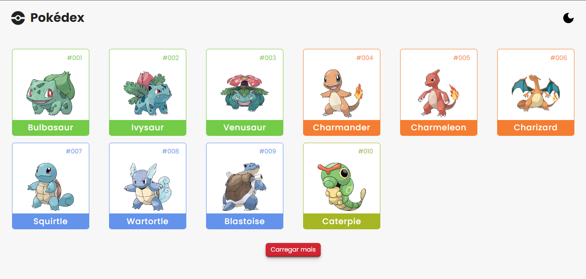
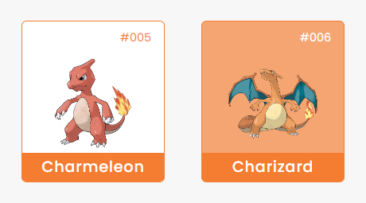
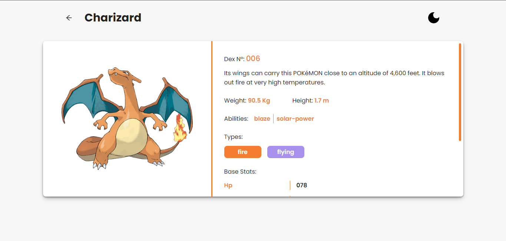
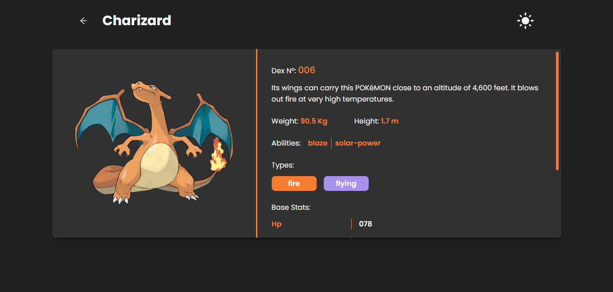

# Pokédex React

Este repositório contém uma aplicação de exemplo chamada "Pokédex React". O propósito desta aplicação é criar uma Pokédex online que permite aos usuários visualizar informações detalhadas sobre os Pokémon, como habilidades e tipo, além de alternar entre os modos de tema claro e escuro.

## Screenshots 🖼

*Homepage light theme*

---
*Homepage dark theme*

---
*Card hover effect*

---
*Details page light theme*

---
*Details page dark theme*

---

## Funcionalidades 📝

A aplicação "Pokédex React" oferece as seguintes funcionalidades:

### Página Inicial (Home)

- Exibe uma lista de 10 Pokémon iniciais, incluindo suas imagens e nomes.
- Cada Pokémon da lista é clicável, permitindo que os usuários acessem uma página interna com informações detalhadas.
- Possui um botão "Carregar mais" que busca mais 10 Pokémon e os adiciona à lista atual.
- Oferece um alternador de tema que permite aos usuários alternar entre os modos de tema claro e escuro.

### Página de Detalhes do Pokémon

- Apresenta informações detalhadas de um Pokémon selecionado, incluindo:
  - Imagem do Pokémon
  - Nome do Pokémon
  - Número na Pokédex
  - Uma breve descrição
  - Peso e altura do Pokémon
  - Habilidades do Pokémon (abilities)
  - Tipo do Pokémon (type)
  - Estatísticas básicas (base stats)

## Ferramentas Utilizadas 🛠

As seguintes ferramentas foram escolhidas para o desenvolvimento deste projeto:

- **Linguagem de Programação:** JavaScript foi escolhido como a linguagem principal.
- **Biblioteca Front-End:** React.js foi utilizada para a criação da interface do usuário.
- **Gerenciamento de Estado:** Context API foi empregada para criar o alternador de tema.
- **Estilização:** styled-components foi utilizado para estilizar os componentes.
- **Navegação:** react-router-dom foi usado para a navegação entre páginas.

## Decisões Adotadas 💡

Durante o planejamento e execução deste projeto, as seguintes decisões foram adotadas:

- **Arquitetura SPA:** A aplicação foi desenvolvida como uma Single Page Application (SPA) para proporcionar uma experiência de usuário mais fluida.
- **Context API para Tema:** A Context API foi escolhida para gerenciar o tema claro/escuro da aplicação devido à sua facilidade de uso e escalabilidade.
- **styled-components:** A estilização com styled-components permite uma melhor organização e modularização do código CSS.
- **Rotas com react-router-dom:** O uso do react-router-dom simplifica a navegação entre as páginas da aplicação.

## Como Rodar o Projeto Localmente 👨‍🔧

Para executar este projeto em seu computador local, siga estas etapas:

1. Clone este repositório:

   `git clone https://github.com/josephmatheus/pokedex-react.git`

2. Navegue para o diretório do projeto:

   `cd pokedex-react`

3. Instale as dependências do projeto:

   `npm install`

4. Inicie o servidor de desenvolvimento:

   `npm run dev`

5. Abra seu navegador e acesse <http://localhost:5173> para visualizar a aplicação, ou pressione a tecla "O" no terminal para o Vite abrir automaticamente o navegador.

## Licença 📝

Este projeto está licenciado sob a [**MIT License**](./LICENSE).
